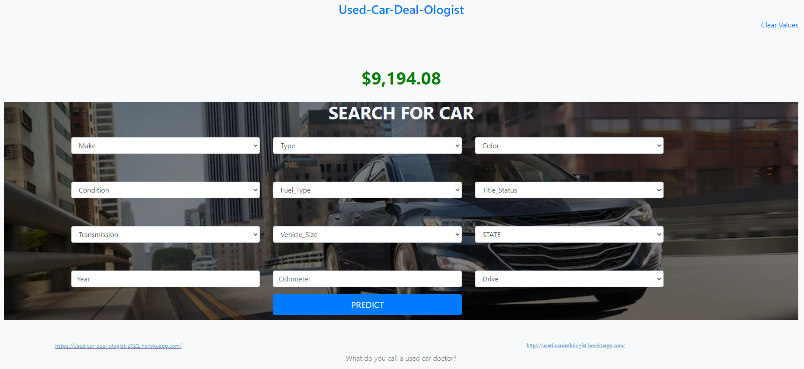

# Used-Car-Deal-Ologist

## Team members:
[Jinhan(Walt) Zhao](https://github.com/jzhao0626), [Franklyn De La Cruz](https://github.com/delacruzfranklyn93), [Tristan Nguyen](https://github.com/tristan1994), and [Sebastian Echeverry](https://github.com/uno-sebastian).
All the members of the team contributed equally in every section of the project.

# Instructions

Make sure to run the flask app by changing directory into the main project folder and running:
```bash
python app.py
```

## Product/Purpose:
The final product is to take the car information dataset to predict and display the range of values that the car can be sold at. We will have an online front-end to connect to our machine learning model where a user can input the information for a car and display a price range for that car. The machine learning model will ingest data from a particular car’s information and output a monetary value. We can then process insights from data generated from the machine learning model.

The team collectively reviewed the dataset and cleaned the data by removing outliers, dummy, and dishonest data. The dataset chosen (below) included 15 individual files and a total of 21 columns with 374,278 rows of information. Our challenge was to predict the price of the car with the the chosen features. All aspects of this project were approached as a team.

## Extract:

### Source of datasets: 
https://www.kaggle.com/austinreese/craigslist-carstrucks-data

## Transform:
Jupyter notebook, Python, and Pandas were used to import, clean, and merge datasets.
* Remove the cars with zero price
* Remove the cars with one dollar price. Looks like there were tons of cars being sold for one dollar and skews our data. 
* 	There is a great discussion to be had over if we want to add price under $100 to the filtering.
* Remove the price outliers. (someone put their phone number as the price, lol)
* Remove the odometer outliers
* Remove the salvage cars
* Remove the titles 'salvage cars' and 'parts only'
*	Each clean dataset was exported as csv.

## Load:
Tableau was used for the final dataset
*	Loaded the final cleaned dataset in the form of a CSV into Tableau to perform exploratory data analysis.
*	Once we had the data loaded we explored how the different columns/features affects the price of the used car and created several visualizations displaying our findings.
*	We used scikit learn to train the model on the dataset using the pipelines objects.

# Wireframe Goals

These are the agreed upon wireframes for the dashboard we want to create. All these graphs and data are subject to change based on data availability and scope.

### MainPage
 
The Main page shows the fields to input car data for checking against the trained model. When a user inputs their data, they hit the submit button to predict their car's value. The user will be redirected to a page where the price of the vehicle will show up on the top of the hero image. Lastly there is a reset button on the top right corner of the screen that can zero out all the input fields of the data.


# Flask Structure and Final Product Developed


Dashboard showing all the input fields.


Dashboard showing all the input fields.

## References

1. [*"Craigslist Car Data"*](https://www.kaggle.com/austinreese/craigslist-carstrucks-data) The web scrape of car data used
